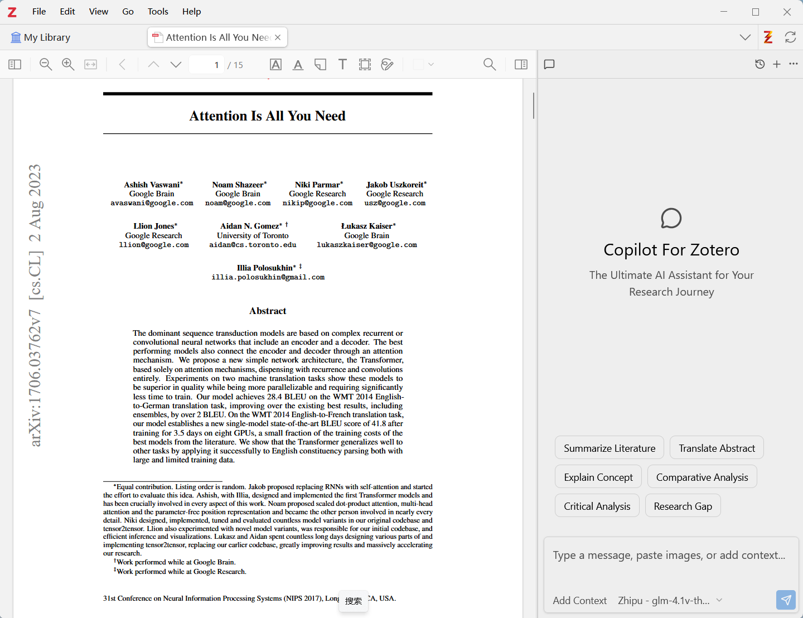
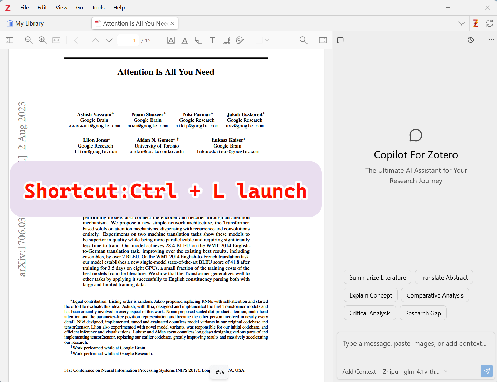
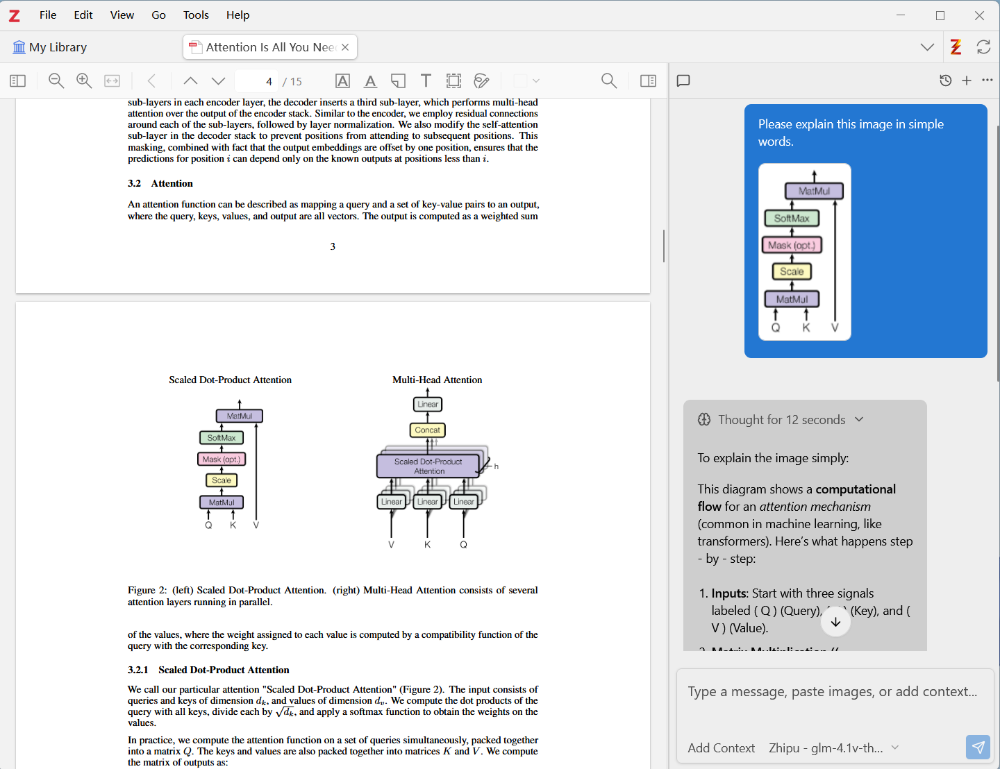
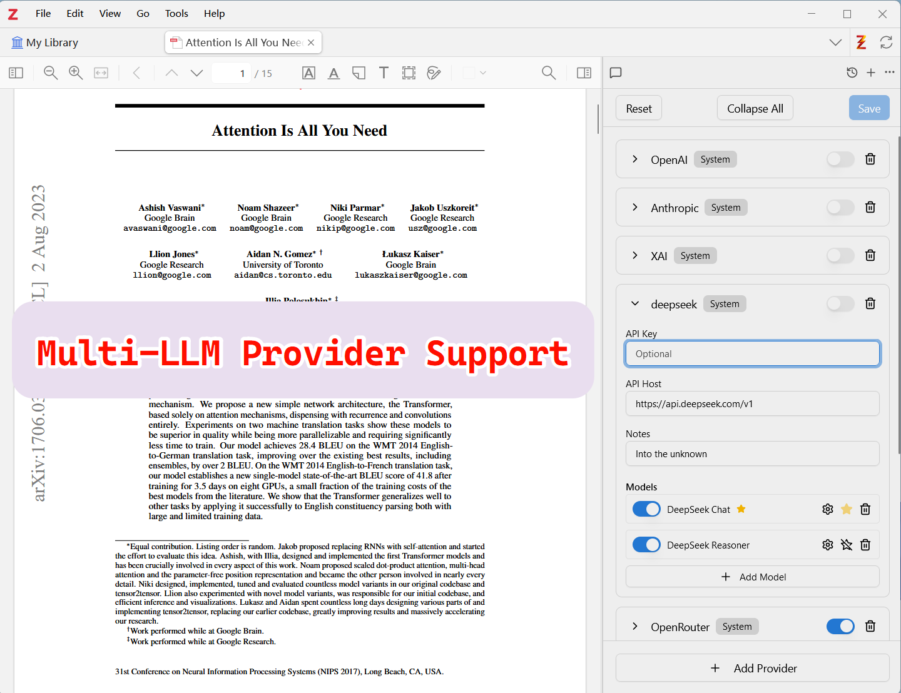
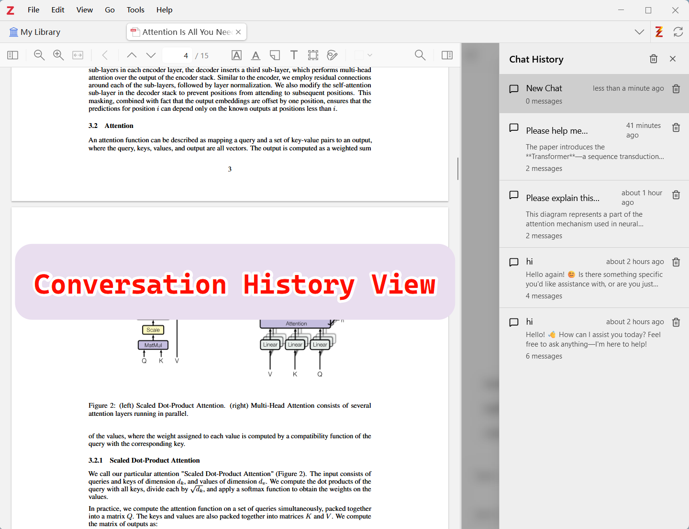
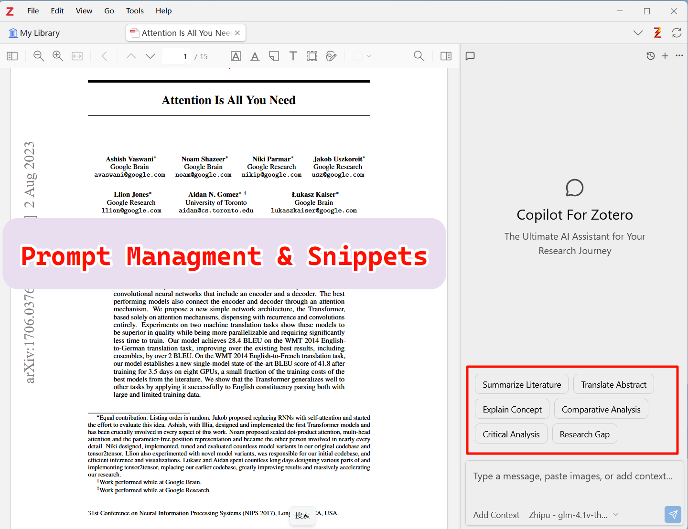

  
  
  # Zotero Copilot (now BibGenie)
  
  ### 🧞 您的 Zotero 智能 AI 助手
  
  [English](README.MD) | 简体中文
  
  
  
  
  

---

## 📢 重要通知 - 项目更名

> **⚠️ 品牌更名公告**
> 
> 我们收到了 Zotero 团队的友好提醒，"Zotero" 是注册商标，不能直接用于产品名称。为了尊重知识产权并避免用户混淆，自 **2025 年 11 月 9 日**起，**Zotero Copilot** 正式更名为 **[BibGenie](https://www.bibgenie.com)**。
> 
> **这对您意味着什么：**
> - ✅ 所有功能保持不变
> - ✅ 您的数据和设置得到保留
> - ✅ 在新名称下继续开发和支持
> - 🔗 **新项目地址**: [github.com/BaiRuic/BibGenie](https://github.com/BaiRuic/BibGenie)
> - 🌐 **官方网站**: [www.bibgenie.com](https://www.bibgenie.com)
> 
> 请访问我们的[新仓库](https://github.com/BaiRuic/BibGenie)以获取最新更新和版本发布。感谢您的理解和持续支持！🙏

---

## 关于 Zotero Copilot

**Zotero Copilot 是一款强大的 Zotero AI 助手插件，帮助研究人员理解 PDF 文献、回答研究问题、提升科研效率。**

**🌐 更多信息请访问官方网站：[www.bibgenie.com](https://www.bibgenie.com)**

[下载插件](#-安装) · [加入 Discord](https://discord.gg/kDXFAAYDNE)

---

## ✨ 核心特性

### 🤖 多模型支持
与 ChatGPT、Claude、Gemini、DeepSeek、Qwen、Kimi 等多个 AI 模型无缝集成，选择最适合您研究需求的 AI 模型。

- ✅ **OpenAI (ChatGPT)** - GPT-4, GPT-3.5
- ✅ **Anthropic (Claude)** - Claude 3.5 Sonnet, Claude 3 Opus
- ✅ **Google (Gemini)** - Gemini Pro, Gemini Ultra
- ✅ **DeepSeek** - DeepSeek Chat, DeepSeek Coder
- ✅ **Alibaba (Qwen)** - 通义千问系列
- ✅ **Moonshot (Kimi)** - Kimi Chat
- ✅ **Ollama** - 本地模型支持
- ✅ **OpenRouter** - 统一 API 接入

### 🎯 与 Zotero 深度集成

<table>
  <tr>
    <td width="50%">
      <h4>📋 快捷键操作</h4>
      <ul>
        <li><kbd>Ctrl</kbd> + <kbd>L</kbd> 快速打开聊天对话框</li>
        <li><kbd>Ctrl</kbd> + <kbd>V</kbd> 直接粘贴图片到对话框</li>
        <li>无需手动导入，流畅的研究体验</li>
      </ul>
    </td>
    <td width="50%">
      <h4>📚 智能上下文管理</h4>
      <ul>
        <li>一键添加当前阅读的 PDF 到 LLM 上下文</li>
        <li>搜索并添加文库中的任意 PDF 附件</li>
        <li>无需手动复制粘贴，自动提取内容</li>
      </ul>
    </td>
  </tr>
  <tr>
    <td width="50%">
      <h4>💬 对话历史管理</h4>
      <ul>
        <li>保存所有聊天记录</li>
        <li>一键继续之前的对话</li>
        <li>方便回顾研究思路</li>
      </ul>
    </td>
    <td width="50%">
      <h4>⚡ Prompt 快捷管理</h4>
      <ul>
        <li>内置 Prompt 模板库</li>
        <li>支持自定义 Prompt</li>
        <li>快捷输入，提升效率</li>
      </ul>
    </td>
  </tr>
</table>

---

## 📸 产品截图

### 主界面 - 与 Zotero 完美融合

### 快捷键操作 - Ctrl+L 打开对话框

### 图片输入支持 - Ctrl+V 粘贴图片

### 添加上下文 - 智能 PDF 管理

### 多模型支持 - 自由切换 AI 模型

### 对话历史 - 回顾研究思路

### Prompt 管理 - 快捷输入模板

---

## 🚀 安装

### 系统要求
- **Zotero 7** (目前仅支持 Zotero 7，Zotero 8 支持正在开发中)
- Windows / macOS / Linux

### 安装步骤

1. **下载插件**
   - 前往 [Releases](https://github.com/BaiRuic/BibGenie/releases) 页面
   - 下载最新版本的 `.xpi` 文件

2. **安装到 Zotero**
   - 打开 Zotero
   - 进入 `工具` → `插件`
   - 点击右上角齿轮图标 ⚙️
   - 选择 `Install Add-on From File...`
   - 选择下载的 `.xpi` 文件
   - 重启 Zotero

---

## ❓ 常见问题

<strong>是否提供免费试用？</strong>

 
对于免费用户，我们提供永久免费使用权限。您只需要配置自己的 AI 模型 API Key 即可使用。

<strong>支持哪些文档格式？</strong>

 
目前仅支持 PDF 附件。其他文件类型的支持正在开发中，即将推出。

<strong>Zotero Copilot 如何安全访问我的研究论文？</strong>

 
Zotero Copilot 通过官方安全 API 连接到您的 Zotero 文库。您的研究数据完全私密和安全，存储在您的本地设备上。我们从不上传您的研究内容或索引到外部服务器。

<strong>可以集成自己的 AI 模型和 API 吗？</strong>

 
当然可以！Zotero Copilot 支持自定义 LLM 配置，您可以使用自己的 API Host 和 Key 设置多个 AI 模型。您可以在研究过程中无缝切换不同模型以获得最佳效果。

<strong>支持哪些版本的 Zotero？</strong>

 
目前仅支持 Zotero 7。Zotero 8 的支持正在开发中，即将推出。

<strong>在哪里可以获得帮助和支持？</strong>

 
加入我们活跃的 Discord 社区，我们的开发团队和研究人员同行随时准备提供帮助。

---

## 📞 联系我们

- **Discord 社区**: [加入我们](https://discord.gg/kDXFAAYDNE)
- **官方网站**: [www.bibgenie.com](https://www.bibgenie.com)
- **邮箱**: support@bibgenie.com

---

  
  **用 Zotero Copilot（现 BibGenie）开启您的智能研究之旅** 🚀
  
  [立即下载](https://github.com/BaiRuic/BibGenie/releases) · [访问官网](https://www.bibgenie.com) · [加入社区](https://discord.gg/kDXFAAYDNE)
  
  ---
  
  Made with ❤️ by the Zotero Copilot（现 BibGenie） Team
  

